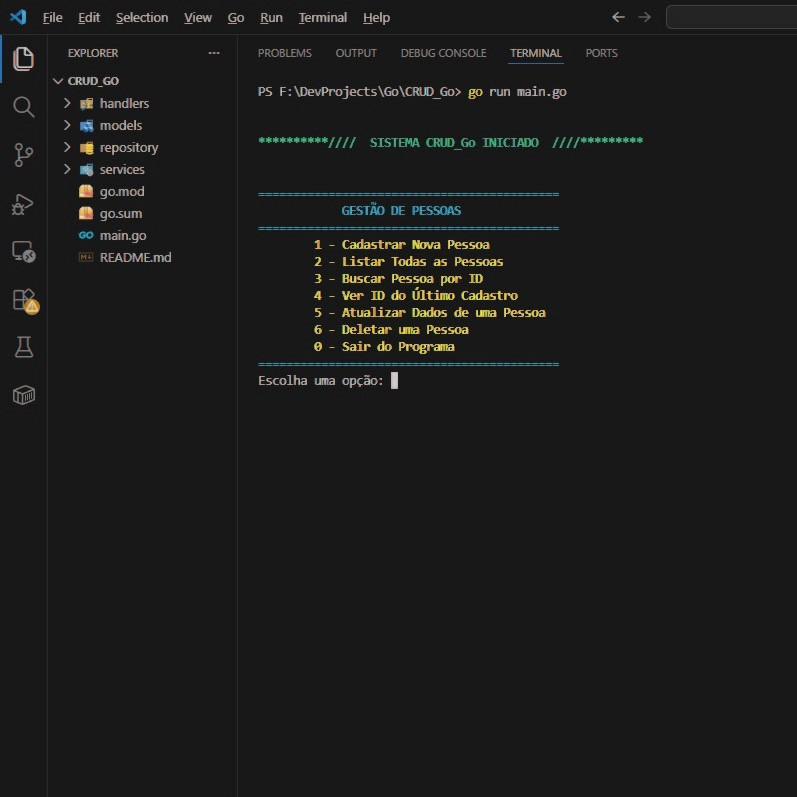

## 🚀 Gestão de Pessoas: CRUD de Alta Performance em Go

  
  <video src="assets/video/demo.mp4" width="600" controls></video>

## 📌 Visão Geral do Projeto

Este sistema nasceu como minha primeira experiência profunda com a linguagem Go (Golang).  
Trata-se de um ecossistema completo de cadastro (CRUD) focado na entidade Pessoa, desenvolvido para suprir demandas de registro em ambientes como departamentos de RH ou estabelecimentos comerciais.  
O objetivo central foi unir a simplicidade e performance do Go a uma interface de terminal que fosse, ao mesmo tempo, intuitiva e visualmente organizada.

---
## 🏆 Motivação e Propósito

 A escolha por este projeto foi motivada pelo desejo de dominar os pilares do Go: tipagem forte, manipulação de ponteiros e eficiência em tempo de execução.  
Mais do que apenas "fazer funcionar", o foco foi aplicar padrões de mercado que tornem o código escalável e pronto para o mundo real, garantindo que cada pessoa cadastrada possua uma identificação única e imutável.

---
## ⚙ Estrutura e Engenharia (Clean Code)
### Para garantir a manutenibilidade, o software foi construído sob uma Arquitetura em Camadas, separando responsabilidades de forma clara:

* **`Handlers`**: Gerenciam o ciclo de vida da interface, controlando a interação direta com o usuário através de um prompt interativo.
* **`Services`**: Camada lógica que gerencia as regras de negócio e conversões (como a validação de UUIDs).
* **`Repository`**: Responsável pela persistência e manipulação direta dos dados. Atualmente operando em memória, mas já isolado para fácil transição.
* **`Models`**: Definição rigorosa da estrutura da entidade `Pessoa`, garantindo consistência em todo o fluxo.
---

## 💻 Tecnologias de Ponta
### Para elevar a experiência do usuário e a robustez técnica, foram integradas as seguintes tecnologias:

*   **[Fatih/Color](github.com):** Implementação de uma identidade visual moderna e colorida diretamente no terminal (UX).
*   **[Google/UUID](github.com):** Geração de chaves únicas universais para evitar colisões de registros.
*   **Go Modules:** Gerenciamento de dependências limpo e eficiente.

---
## 📜 Contexto e Disponibilidade

 
Desenvolvido em janeiro de 2026, o sistema opera como uma ferramenta de CLI (Interface de Linha de Comando) robusta. 
Atualmente, ele gerencia dados em memória interna, mas foi arquitetado estrategicamente para que a migração para bancos  
de dados relacionais (como PostgreSQL ou MySQL) ocorra de forma transparente e sem quebras de lógica. 

---

## 🔦 Como Explorar
* Instale as dependências: go mod tidy
* Execute o sistema: go run main.go
---

## 📈 Roadmap de Evolução
### Como próximo passo, pretendo evoluir este projeto para:
*   Conexão com banco de dados persistente.
*   Implementação de middlewares para validação de CPF e E-mail.
*   Criação de uma camada de API REST compartilhando o mesmo repositório.
---

